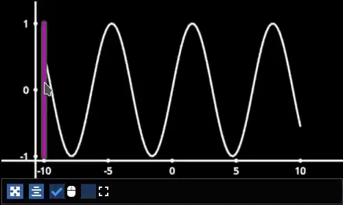
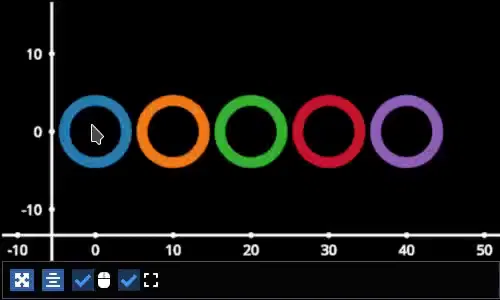
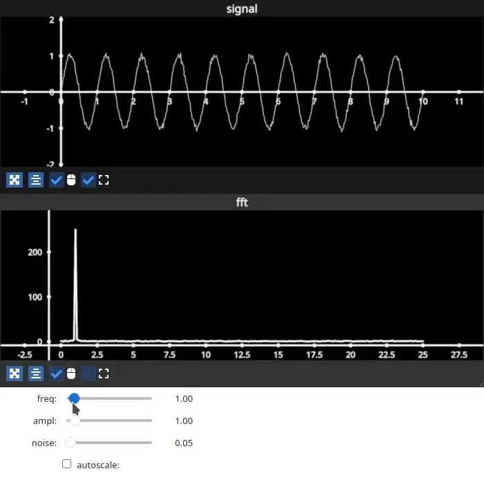
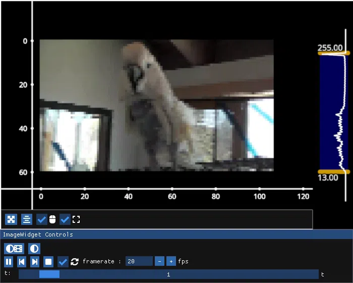
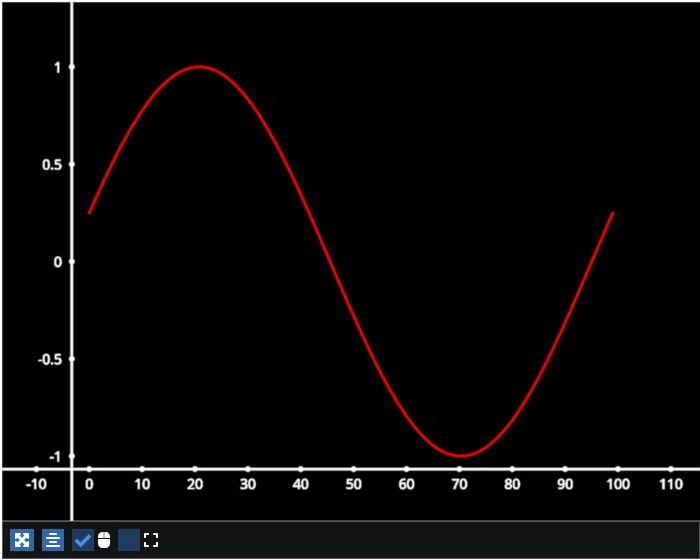

User Guide
==========

Installation
------------

To install use pip:

.. code-block::

    # with imgui and jupyterlab
    pip install -U "fastplotlib[notebook,imgui]"

    # minimal install, install glfw, pyqt6 or pyside6 separately
    pip install -U fastplotlib

    # with imgui
    pip install -U "fastplotlib[imgui]"

    # to use in jupyterlab, no imgui
    pip install -U "fastplotlib[notebook]"

We strongly recommend installing ``simplejpeg`` for use in notebooks, you must first install `libjpeg-turbo <https://libjpeg-turbo.org/>`_.

- If you use ``conda``, you can get ``libjpeg-turbo`` through conda.
- If you are on linux you can get it through your distro's package manager.
- For Windows and Mac compiled binaries are available on their release page: https://github.com/libjpeg-turbo/libjpeg-turbo/releases

Once you have ``libjpeg-turbo``:

.. code-block::

    pip install simplejpeg

What is ``fastplotlib``?
------------------------

``fastplotlib`` is a cutting-edge plotting library built using the `pygfx <https://github.com/pygfx/pygfx>`_ rendering engine.
The lower-level details of the rendering process (i.e. defining a scene, camera, renderer, etc.) are abstracted away, allowing users to focus on their data.
The fundamental goal of ``fastplotlib`` is to provide a high-level, expressive API that promotes large-scale explorative scientific visualization. We want to
make it easy and intuitive to produce interactive visualizations that are as performant and vibrant as a modern video game 😄

``fastplotlib`` basics
----------------------

Before giving a detailed overview of the library, here is a minimal example::

    import fastplotlib as fpl
    import imageio.v3 as iio

    # create a `Figure`
    fig = fpl.Figure()

    # read data
    data = iio.imread("imageio:astronaut.png")

    # add image graphic
    image_graphic = fig[0, 0].add_image(data=data)

    # show the plot
    fig.show()

    if __name__ == "__main__":
        fpl.loop.run()

.. image:: ../_static/guide_hello_world.png

This is just a simple example of how the ``fastplotlib`` API works to create a plot, add some image data to the plot, and then visualize it.
However, we are just scratching the surface of what is possible with ``fastplotlib``.
Next, let's take a look at the building blocks of ``fastplotlib`` and how they can be used to create more complex visualizations.

In addition to this user guide, the Examples Gallery is the best place to learn how to do specific things in fastplotlib. The `quickstart notebook <https://github.com/fastplotlib/fastplotlib/blob/main/examples/notebooks/quickstart.ipynb>`_ is also an excellent introduction to the API, even if you do not plan to use ``fastplotlib`` in notebooks. Remember, ``fastplotlib`` code is pretty much identical whether it's used in jupyterlab, Qt, or glfw!

If you still need help don't hesitate to post an issue or discussion post!

Figure
------

The starting point for creating any visualization in ``fastplotlib`` is a ``Figure`` object. This can be a single subplot or many subplots.
The ``Figure`` object houses and takes care of the underlying rendering components such as the camera, controller, renderer, and canvas.
Most users won't need to use these directly; however, the ability to directly interact with the rendering engine is still available if
needed.

By default, if no ``shape`` argument is provided when creating a ``Figure``, there will be a single ``Subplot``.

If a shape argument is provided, all subplots in a ``Figure`` can be accessed by indexing (i.e. ``fig_object[i ,j]``). A "window layout"
with customizable subplot positions and sizes can also be set by providing a ``rects`` or ``extents`` argument. The Examples Gallery
has a few examples that show how to create a "Window Layout".

After defining a ``Figure``, we can begin to add ``Graphic`` objects.

Graphics
--------

A ``Graphic`` can be an image, a line, a scatter, a collection of lines, and more. All graphics can also be given a convenient ``name``. This allows graphics
to be easily accessed from figures::

    # create a `Figure`
    fig = fpl.Figure()

    # read data
    data = iio.imread("imageio:astronaut.png")

    add image graphic
    image_graphic = fig[0, 0].add_image(data=data, name="astronaut")

    # show figure
    fig.show()

    # index subplot to get graphic
    fig[0, 0]["astronaut"]

    # another way to index graphics in a subplot
    fig[0, 0].graphics[0] is fig[0, 0]["astronaut"]  # will return `True`

..

See the examples gallery for examples on how to create and interactive with all the various types of graphics.

Graphics also have mutable properties. Some of these properties, such as the ``data`` or ``colors`` of a line can even be sliced,
allowing for the creation of very powerful visualizations. Event handlers can be added to a graphic to capture changes to
any of these properties.

(1) Common properties that all graphics have

+--------------+--------------------------------------------------------------------------------------------------------------+
| Feature Name | Description                                                                                                  |
+==============+==============================================================================================================+
| name         | Graphic name                                                                                                 |
+--------------+--------------------------------------------------------------------------------------------------------------+
| offset       | Offset position of the graphic, [x, y, z]                                                                    |
+--------------+--------------------------------------------------------------------------------------------------------------+
| rotation     | Graphic rotation quaternion                                                                                  |
+--------------+--------------------------------------------------------------------------------------------------------------+
| visible      | Access or change the visibility                                                                              |
+--------------+--------------------------------------------------------------------------------------------------------------+
| deleted      | Used when a graphic is deleted, triggers events that can be useful to indicate this graphic has been deleted |
+--------------+--------------------------------------------------------------------------------------------------------------+

(2) Graphic-Specific properties

    (a) ``ImageGraphic``

    +------------------------+---------------------------------------------------+
    | Feature Name           | Description                                       |
    +========================+===================================================+
    | data                   | Underlying image data                             |
    +------------------------+---------------------------------------------------+
    | vmin                   | Lower contrast limit of an image                  |
    +------------------------+---------------------------------------------------+
    | vmax                   | Upper contrast limit of an image                  |
    +------------------------+---------------------------------------------------+
    | cmap                   | Colormap for a grayscale image, ignored if RGB(A) |
    +------------------------+---------------------------------------------------+

    (b) ``LineGraphic``, ``LineCollection``, ``LineStack``

    +--------------+--------------------------------+
    | Feature Name | Description                    |
    +==============+================================+
    | data         | underlying data of the line(s) |
    +--------------+--------------------------------+
    | colors       | colors of the line(s)          |
    +--------------+--------------------------------+
    | cmap         | colormap of the line(s)        |
    +--------------+--------------------------------+
    | thickness    | thickness of the line(s)       |
    +--------------+--------------------------------+

    (c) ``ScatterGraphic``

    +--------------+---------------------------------------+
    | Feature Name | Description                           |
    +==============+=======================================+
    | data         | underlying data of the scatter points |
    +--------------+---------------------------------------+
    | colors       | colors of the scatter points          |
    +--------------+---------------------------------------+
    | cmap         | colormap of the scatter points        |
    +--------------+---------------------------------------+
    | sizes        | size of the scatter points            |
    +--------------+---------------------------------------+

    (d) ``TextGraphic``

    +-------------------+---------------------------+
    | Feature Name      | Description               |
    +===================+===========================+
    | text              | data of the text          |
    +-------------------+---------------------------+
    | font_size         | size of the text          |
    +-------------------+---------------------------+
    | face_color        | color of the text face    |
    +-------------------+---------------------------+
    | outline_color     | color of the text outline |
    +-------------------+---------------------------+
    | outline_thickness | thickness of the text     |
    +-------------------+---------------------------+

Using our example from above: once we add a ``Graphic`` to the figure, we can then begin to change its properties. ::

    image_graphic.vmax = 150

.. image:: ../_static/guide_hello_world_vmax.png

``Graphic`` properties also support numpy-like slicing for getting and setting data. For example ::

    # basic numpy-like slicing, set the top right corner
    image_graphic.data[:150, -150:] = 0

.. image:: ../_static/guide_hello_world_simple_slicing.png

Fancy indexing is also supported! ::

    bool_array = np.random.choice([True, False], size=(512, 512), p=[0.1, 0.9])
    image_graphic.data[bool_array] = 254

.. image:: ../_static/guide_hello_world_fancy_slicing.png

Selectors
---------

A primary feature of ``fastplotlib`` is the ability to easily interact with your data. Two extremely helpful tools that can
be used in order to facilitate this process are a ``LinearSelector`` and ``LinearRegionSelector``.

A ``LinearSelector`` is a horizontal or vertical line slider. This tool allows you to very easily select different points in your
data. Let's look at an example: ::

    import fastplotlib as fpl
    import numpy as np

    # generate data
    xs = np.linspace(-10, 10, 100)
    ys = np.sin(xs)
    sine = np.column_stack([xs, ys])

    fig = fpl.Figure()

    sine_graphic = fig[0, 0].add_line(data=sine, colors="w")

    # add a linear selector the sine wave
    selector = sine_graphic.add_linear_selector()

    fig.show(maintain_aspect=False)

A ``LinearRegionSelector`` is very similar to a ``LinearSelector`` but as opposed to selecting a singular point of
your data, you are able to select an entire region.

See the examples gallery for more in-depth examples with selector tools.

Now we have the basics of creating a ``Figure``, adding ``Graphics`` to a ``Figure``, and working with ``Graphic`` properties to dynamically change or alter them.

Events
------

Events can be a multitude of things: canvas events such as mouse or keyboard events, or events related to ``Graphic`` properties.

There are two ways to add events to a graphic:

1) Use the method `add_event_handler()` ::

    def event_handler(ev):
        pass

    graphic.add_event_handler(event_handler, "event_type")

..

2) or a decorator ::

    @graphic.add_event_handler("event_type")
    def event_handler(ev):
        pass

..

The ``event_handler`` is a user-defined callback function that accepts an event instance as the first and only positional argument.
Information about the structure of event instances are described below. The ``"event_type"``
is a string that identifies the type of event.

``graphic.supported_events`` will return a tuple of all ``event_type`` strings that this graphic supports.

When an event occurs, the user-defined event handler will receive an event object. Depending on the type of event, the
event object will have relevant information that can be used in the callback. See the next section for details.

Graphic property events
^^^^^^^^^^^^^^^^^^^^^^^

All ``Graphic`` events are instances of ``fastplotlib.GraphicFeatureEvent`` and have the following attributes:

    +------------+-------------+-----------------------------------------------+
    | attribute  | type        | description                                   |
    +============+=============+===============================================+
    | type       | str         | name of the event type                        |
    +------------+-------------+-----------------------------------------------+
    | graphic    | Graphic     | graphic instance that the event is from       |
    +------------+-------------+-----------------------------------------------+
    | info       | dict        | event info dictionary                         |
    +------------+-------------+-----------------------------------------------+
    | target     | WorldObject | pygfx rendering engine object for the graphic |
    +------------+-------------+-----------------------------------------------+
    | time_stamp | float       | time when the event occurred, in ms           |
    +------------+-------------+-----------------------------------------------+

Selectors have one event called ``selection`` which has extra attributes in addition to those listed in the table above.
The selection event section covers these.

The ``info`` attribute for most graphic property events will have one key, ``"value"``, which is the new value
of the graphic property. Events for graphic properties that represent arrays, such the ``data`` properties for
images, lines, and scatters will contain more entries. Here are a list of all graphic properties that have such
additional entries:

* ``ImageGraphic``
    * data

* ``LineGraphic``
    * data, colors, cmap

* ``ScatterGraphic``
    * data, colors, cmap, sizes

You can understand an event's attributes by adding a simple event handler::

    @graphic.add_event_handler("event_type")
    def handler(ev):
        print(ev.type)
        print(ev.graphic)
        print(ev.info)

    # trigger the event
    graphic.event_type = <new data>

    # direct example
    @image_graphic.add_event_handler("cmap")
    def cmap_changed(ev):
        print(ev.type)
        print(ev.info)

    image_graphic.cmap = "viridis"
    # this will trigger the cmap event and print the following:
    # 'cmap'
    # {"value": "viridis"}

..

The :ref:`event_tables` provide a description of the event info dicts for all Graphic Feature Events.

Selection event
~~~~~~~~~~~~~~~

The ``selection`` event for selectors has additional attributes, mostly ``callable`` methods, that aid in using the
selector tool, such as getting the indices or data under the selection. The ``info`` dict will contain one entry ``value``
which is the new selection value.

The :ref:`event_tables` provide a description of the additional attributes as well as the event info dicts for selector events.

Canvas Events
^^^^^^^^^^^^^

Canvas events can be added to a graphic or to a Figure (see next section).
Here is a description of all canvas events and their attributes.

The examples gallery provides several examples using pointer and key events.

Pointer events
~~~~~~~~~~~~~~

**List of pointer events:**

* **pointer_down**: emitted when the user interacts with mouse,

* **pointer_up**: emitted when the user releases a pointer.

* **pointer_move**: emitted when the user moves a pointer.
  This event is throttled.

* **click**: emmitted when a mouse button is clicked.

* **double_click**: emitted on a double-click.
  This event looks like a pointer event, but without the touches.

* **wheel**: emitted when the mouse-wheel is used (scrolling),
  or when scrolling/pinching on the touchpad/touchscreen.

  Similar to the JS wheel event, the values of the deltas depend on the
  platform and whether the mouse-wheel, trackpad or a touch-gesture is
  used. Also, scrolling can be linear or have inertia. As a rule of
  thumb, one "wheel action" results in a cumulative ``dy`` of around
  100. Positive values of ``dy`` are associated with scrolling down and
  zooming out. Positive values of ``dx`` are associated with scrolling
  to the right. (A note for Qt users: the sign of the deltas is (usually)
  reversed compared to the QWheelEvent.)

  On MacOS, using the mouse-wheel while holding shift results in horizontal
  scrolling. In applications where the scroll dimension does not matter,
  it is therefore recommended to use `delta = event['dy'] or event['dx']`.

    * *dx*: the horizontal scroll delta (positive means scroll right).
    * *dy*: the vertical scroll delta (positive means scroll down or zoom out).
    * *x*: the mouse horizontal position during the scroll.
    * *y*: the mouse vertical position during the scroll.
    * *buttons*: a tuple of buttons being pressed down.
    * *modifiers*: a tuple of modifier keys being pressed down.
    * *time_stamp*: a timestamp in seconds.

All pointer events have the following attributes:

* *x*: horizontal position of the pointer within the widget.
* *y*: vertical position of the pointer within the widget.
* *button*: the button to which this event applies. See "Mouse buttons" section below for details.
* *buttons*: a tuple of buttons being pressed down (see below)
* *modifiers*: a tuple of modifier keys being pressed down. See section below for details.
* *ntouches*: the number of simultaneous pointers being down.
* *touches*: a dict with int keys (pointer id's), and values that are dicts
  that contain "x", "y", and "pressure".
* *time_stamp*: a timestamp in seconds.

**Mouse buttons:**

* 0: No button.
* 1: Left button.
* 2: Right button.
* 3: Middle button
* 4-9: etc.

Key events
~~~~~~~~~~

**List of key (keyboard keys) events:**

* **key_down**: emitted when a key is pressed down.

* **key_up**: emitted when a key is released.

Key events have the following attributes:

* *key*: the key being pressed as a string. See section below for details.
* *modifiers*: a tuple of modifier keys being pressed down.
* *time_stamp*: a timestamp in seconds.

The key names follow the `browser spec <https://developer.mozilla.org/en-US/docs/Web/API/KeyboardEvent>`_.

* Keys that represent a character are simply denoted as such. For these the case matters:
  "a", "A", "z", "Z" "3", "7", "&", " " (space), etc.
* The modifier keys are:
  "Shift", "Control", "Alt", "Meta".
* Some example keys that do not represent a character:
  "ArrowDown", "ArrowUp", "ArrowLeft", "ArrowRight", "F1", "Backspace", etc.

Time stamps
~~~~~~~~~~~

Since the time origin of ``time_stamp`` values is undefined,
time stamp values only make sense in relation to other time stamps.

Add canvas event handlers to a Figure
^^^^^^^^^^^^^^^^^^^^^^^^^^^^^^^^^^^^^

You can add event handlers to a ``Figure`` object's renderer. For example, this is useful for defining click events
where you want to map click positions to the nearest graphic object. See the previous section for a description
of all the canvas events.

Renderer event handlers can be added using a method or a decorator.

For example: ::

    import fastplotlib as fpl
    import numpy as np

    # generate some circles
    def make_circle(center, radius: float, n_points: int = 75) -> np.ndarray:
        theta = np.linspace(0, 2 * np.pi, n_points)
        xs = radius * np.sin(theta)
        ys = radius * np.cos(theta)

        return np.column_stack([xs, ys]) + center

    # this makes 5 circles, so we can create 5 cmap values, so it will use these values to set the
    # color of the line based by using the cmap as a LUT with the corresponding cmap_value
    circles = list()
    for x in range(0, 50, 10):
        circles.append(make_circle(center=(x, 0), radius=4, n_points=100))

    # create figure
    fig = fpl.Figure()

    # add circles to plot
    circles_graphic = fig[0,0].add_line_collection(data=circles, cmap="tab10", thickness=10)

    # get the nearest graphic that is clicked and change the color
    @fig.renderer.add_event_handler("click")
    def click_event(ev):
        # reset colors
        circles_graphic.cmap = "tab10"

        # map the click position to world coordinates
        xy = fig[0, 0].map_screen_to_world(ev)[:-1]

        # get the nearest graphic to the position
        nearest = fpl.utils.get_nearest_graphics(xy, circles_graphic)[0]

        # change the closest graphic color to white
        nearest.colors = "w"

    fig.show()

Integrating with UI libraries
-----------------------------

After you are comfortable with creating graphics, changing their properties, and creating events, you can easily integrate
``fastplotlib`` with common UI libraries such as ``ipywidgets``, ``Qt``, and ``imgui``. ``wx`` should also work but this
is not thoroughly tested.

ipywidgets
^^^^^^^^^^

The `ipywidgets <https://ipywidgets.readthedocs.io/en/stable/>`_ library is great for rapidly building UIs for prototyping
in jupyter. It is particularly useful for scientific and engineering applications since we can rapidly create a UI to
interact with our ``fastplotlib`` visualization. The main downside is that it only works in jupyter.

For examples please see the examples gallery.

Qt
^^

Qt is a very popular UI library written in C++, ``PyQt6`` and ``PySide6`` provide python bindings. There are countless
tutorials on how to build a UI using Qt which you can easily find if you google ``PyQt``. You can embed a ``Figure`` as
a Qt widget within a Qt application.

For examples please see the examples gallery.

imgui
^^^^^

`Imgui <https://github.com/pthom/imgui_bundle>`_ is also a very popular library used for building UIs. The difference
between imgui and ipywidgets, Qt, and wx is the imgui UI can be rendered directly on the same canvas as a fastplotlib
``Figure``. This is hugely advantageous, it means that you can write an imgui UI and it will run on any GUI backend,
i.e. it will work in jupyter, Qt, glfw and wx windows! The programming model is different from Qt and ipywidgets, there
are no callbacks, but it is easy to learn if you see a few examples.

.. image:: ../_static/guide_imgui.png

We specifically use `imgui-bundle <https://github.com/pthom/imgui_bundle>`_ for the python bindings in fastplotlib.
There is large community and many resources out there on building UIs using imgui.

To install ``fastplotlib`` with ``imgui`` use the ``imgui`` extras option, i.e. ``pip install fastplotlib[imgui]``, or ``pip install imgui_bundle`` if you've already installed fastplotlib.

Fastplotlib comes built-in with imgui UIs for subplot toolbars and a standard right-click menu with a number of options.
You can also make custom GUIs and embed them within the canvas, see the examples gallery for detailed examples.

**Some tips:**

The ``imgui-bundle`` docs as of March 2025 don't have a nice API list (as far as I know), here is how we go about developing UIs with imgui:

1. Use the ``pyimgui`` API docs to locate the type of UI element we want, for example if we want a ``slider_int``: https://pyimgui.readthedocs.io/en/latest/reference/imgui.core.html#imgui.core.slider_int

2. Look at the function signature in the ``imgui-bundle`` sources. You can usually access this easily with your IDE: https://github.com/pthom/imgui_bundle/blob/a5e7d46555832c40e9be277d4747eac5a303dbfc/bindings/imgui_bundle/imgui/__init__.pyi#L1693-L1696

3. ``pyimgui`` and ``imgui-bundle`` sometimes don't have the same function signature, so we use a combination of the pyimgui docs and
imgui-bundle function signature to understand and implement the UI element.

ImageWidget
-----------

Often times, developing UIs for interacting with multi-dimension image data can be tedious and repetitive.
In order to aid with common image and video visualization requirements the ``ImageWidget`` automatically generates sliders
to easily navigate through different dimensions of your data. The image widget supports 2D, 3D and 4D arrays.

Let's look at an example: ::

    import fastplotlib as fpl
    import imageio.v3 as iio

    movie = iio.imread("imageio:cockatoo.mp4")

    iw_movie = ImageWidget(
        data=movie,
        rgb=True
    )

    iw_movie.show()

Animations
----------

An animation function is a user-defined function that gets called on every rendering cycle. Let's look at an example: ::

    import fastplotlib as fpl
    import numpy as np

    # generate some data
    start, stop = 0, 2 * np.pi
    increment = (2 * np.pi) / 50

    # make a simple sine wave
    xs = np.linspace(start, stop, 100)
    ys = np.sin(xs)

    figure = fpl.Figure(size=(700, 560))

    # plot the image data
    sine = figure[0, 0].add_line(ys, name="sine", colors="r")

    # increment along the x-axis on each render loop :D
    def update_line(subplot):
        global increment, start, stop
        xs = np.linspace(start + increment, stop + increment, 100)
        ys = np.sin(xs)

        start += increment
        stop += increment

        # change only the y-axis values of the line
        subplot["sine"].data[:, 1] = ys

    figure[0, 0].add_animations(update_line)

    figure.show(maintain_aspect=False)

Here we are defining a function that updates the data of the ``LineGraphic`` in the plot with new data. When adding an animation function, the
user-defined function will receive a subplot instance as an argument when it is called.

Spaces
------

There are several spaces to consider when using ``fastplotlib``:

1) World Space

    World space is the 3D space in which graphical objects live. Objects
    and the camera can exist anywhere in this space.

2) Data Space

    Data space is simply the world space plus any offset or rotation that has been applied to an object.

.. note::
    World space does not always correspond directly to data space, you may have to adjust for any offset or rotation of the ``Graphic``.

3) Screen Space

    Screen space is the 2D space in which your screen pixels reside. This space is constrained by the screen width and height in pixels.
    In the rendering process, the camera is responsible for projecting the world space into screen space.

.. note::
    When interacting with ``Graphic`` objects, there is a very helpful function for mapping screen space to world space
    (``Figure.map_screen_to_world(pos=(x, y))``). This can be particularly useful when working with click events where click
    positions are returned in screen space but ``Graphic`` objects that you may want to interact with exist in world
    space.

For more information on the various spaces used by rendering engines please see this `article <https://learnopengl.com/Getting-started/Coordinate-Systems>`_

JupyterLab and IPython
----------------------

In ``jupyter lab`` you have the option to embed ``Figures`` in regular output cells, on the side with ``sidecar``,
or show figures in separate Qt windows. Note: Once you have selected a display mode, we do not recommend switching to
a different display mode. Restart the kernel to reliably choose a different display mode. By default, fastplotlib
figures will be embedded in the notebook cell's output.

The `quickstart example notebook <https://github.com/fastplotlib/fastplotlib/blob/main/examples/notebooks/quickstart.ipynb>`_
is also a great place to start.

Notebooks and remote rendering
^^^^^^^^^^^^^^^^^^^^^^^^^^^^^^

To display the ``Figure`` in the notebook output,  the ``fig.show()`` call must be the last line in the code cell.  Or
you can use ipython's display call: ``display(fig.show())``.

To display the figure on the side: ``fig.show(sidecar=True)``

You can make use of all `ipywidget layout <https://ipywidgets.readthedocs.io/en/latest/examples/Widget%20Layout.html>`_
options to display multiple figures::

    from ipywidgets import VBox, HBox

    # stack figures vertically or horizontally
    VBox([fig1.show(), fig2.show()])

Again the ``VBox([...])`` call must be the last line in the code cell, or you can use ``display(VBox([...]))``

You can combine ipywidget layouting just like any other ipywidget::

    # display a figure on top of two figures laid out horizontally

    VBox([
        fig1.show(),
        HBox([fig2.show(), fig3.show()])
    ])

Embedded figures will also render if you're using the notebook from a remote computer since rendering is done on the
server side and the client only receives a jpeg stream of rendered frames. This allows you to visualize very large
datasets on remote servers since the rendering is done remotely and you do not transfer any of the raw data to the
client.

You can create dashboards or webapps with ``fastplotlib`` by running the notebook with
`voila <https://github.com/voila-dashboards/voila>`_. This is great for sharing visualizations of very large datasets
that are too large to share over the internet, and creating fast interactive applications for the analysis of very
large datasets.

Qt windows in jupyter and IPython
^^^^^^^^^^^^^^^^^^^^^^^^^^^^^^^^^

Qt windows can also be used for displaying fastplotlib figures in an interactive jupyterlab or IPython. You must run
``%gui qt`` **before** importing ``fastplotlib`` (or ``wgpu``). This would typically be done at the very top of your
notebook.

Note that this only works if you are using jupyterlab or ipython locally, this cannot be used for remote rendering.
You can forward windows (ex: X11 forwarding) but this is much slower than the remote rendering described in the
previous section.
