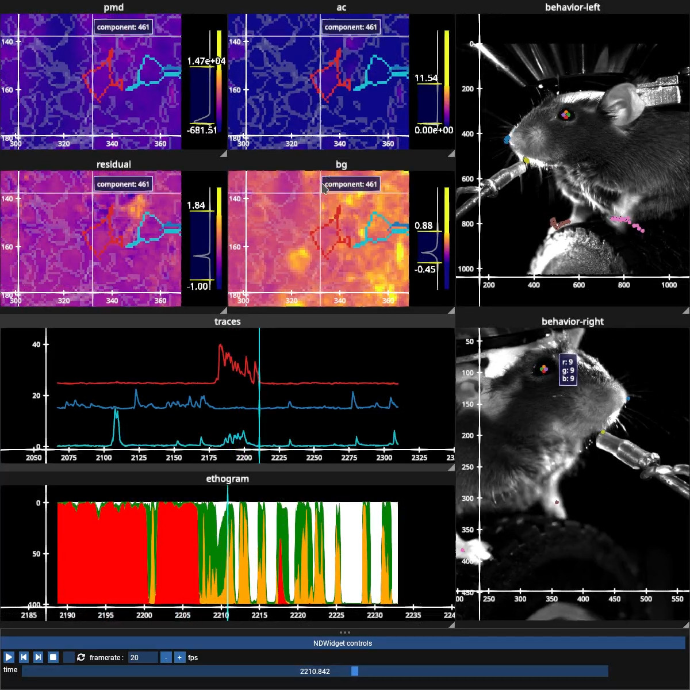
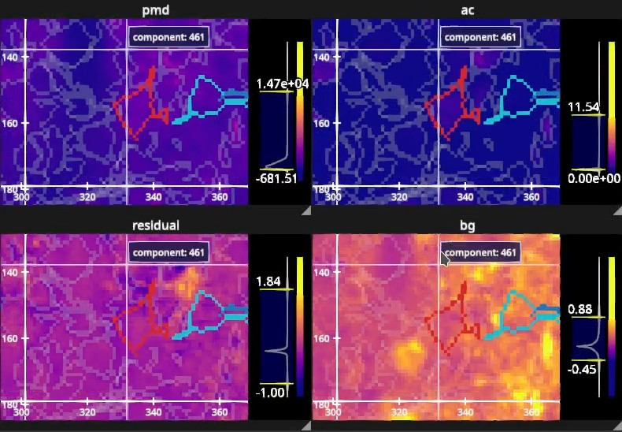
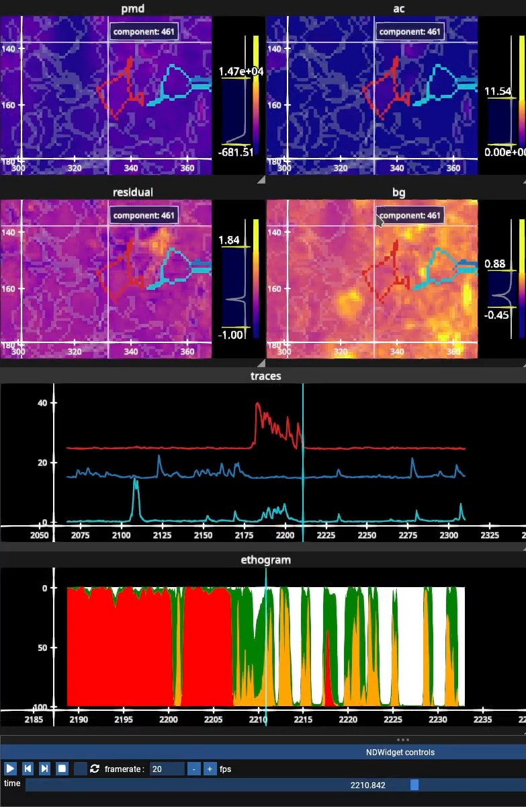

Visualizing multi-modal neuroscience data with the fastplotlib NDWidget
=======================================================================

    Calcium imaging movies, neuron traces, an ethogram, and two behavior videos with tracked keypoints, all on
    one time slider.

A systems neuroscience session can produce many n-dimensional arrays. A multi-plane, multi-FOV calcium imaging
movie has dimensions for the FOV, plane, time, rows and columns. Alongside it there may be electrophysiology
recordings, videos from several behavior cameras, the keypoints tracked in each video, and behavioral labels. Each
of these comes from its own acquisition system with its own shape, dimension order and sampling rate, such as 30 Hz
for a behavior camera, 30 kHz for an electrophysiology probe, and a few Hz for each imaging plane.

The ``NDWidget`` provides a declarative interface for interacting with large volumes of this data, with ease and at
speed. For each array you name its dimensions and declare which of them are drawn. Arrays that share a dimension
name stay in sync, whatever their shape, dimension order or sampling rate. The widget works out the rest: a slider
for every dimension that is not drawn, the mapping from a slider position onto each array's own indices, windowing,
asynchronous reads, and which graphics need to update.

We built the ``NDWidget`` for:

* better quality control of experimental data
* prototyping new analysis ideas and algorithms
* visualizing large datasets on the remote infrastructure where the analysis usually happens
* developing new scientific insights by exploring all of the modalities together

Any n-dimensional data, any graphical representation
----------------------------------------------------

Each array is added with two declarations. ``dims`` names every dimension of the array, in the order in which it
appears in the array, and ``display_dims`` names the dimensions that are drawn, in display order. Every other
dimension becomes a slider::

    # a multi-plane calcium imaging movie, [time, plane, rows, cols]
    ndw["movie"].add_nd_image(
        movie,
        dims=("time", "plane", "m", "n"),
        display_dims=("m", "n"),  # "time" and "plane" become sliders
    )

With ``display_dims=("plane", "m", "n")`` the same movie is drawn as a volume, and only ``"time"`` is a slider.

Positional data, such as traces or keypoints, is an array of shape ``[..., l, p, d]``, where ``l`` is the number of
lines, scatters or heatmap rows, ``p`` is the number of datapoints in each of them, often timepoints, and ``d`` holds
the (x, y) or (x, y, z) coordinate of each datapoint. ``p`` is both drawn and given a slider, and the widget draws a
window of ``p`` around the slider position.

+-----------------------+----------------------------------------------------------------+
| method                | draws                                                          |
+=======================+================================================================+
| ``add_nd_image``      | grayscale or RGB(A) images and volumes, such as calcium        |
|                       | imaging movies                                                 |
+-----------------------+----------------------------------------------------------------+
| ``add_video``         | video frames, with the YUV components sent straight to the     |
|                       | GPU, such as behavior videos                                   |
+-----------------------+----------------------------------------------------------------+
| ``add_nd_timeseries`` | stacked lines, lines, scatters or a heatmap on a time axis,    |
|                       | such as traces, spike rasters, spectrograms and ethograms      |
+-----------------------+----------------------------------------------------------------+
| ``add_nd_scatter``    | scatters, such as tracked keypoints                            |
+-----------------------+----------------------------------------------------------------+
| ``add_nd_lines``      | lines, such as keypoint trajectories                           |
+-----------------------+----------------------------------------------------------------+
| ``add_nd_vectors``    | vectors                                                        |
+-----------------------+----------------------------------------------------------------+

Several of these can share a subplot, such as keypoints drawn over the video they were tracked in.

``add_nd_timeseries`` draws a ``LineStack`` by default. The graphical representation of positional data is not
fixed by its shape, and ``graphic_type`` can be changed while the widget is running, from code or from the
right-click menu of the graphic::

    ndg = ndw["traces"].add_nd_timeseries(
        traces,  # [cell, time, xy]
        dims=("cell", "time", "xy"),
        display_dims=("cell", "time", "xy"),
    )

    ndg.graphic_type = fpl.ImageGraphic  # the same traces as a heatmap

The data does not have to be a numpy array. Anything with ``dtype``, ``ndim``, ``shape`` and ``__getitem__`` can be
used, such as a zarr or HDF5 dataset, a torch tensor, or a lazy reader of your own. The data can even be a function
of the index: an object whose ``__getitem__`` computes the requested slice is used in the same way, such as a calcium
imaging movie that is computed from a matrix factorization one frame at a time. For any other data source, subclass
the slicer for that representation, ``NDImageSlicer`` for images or ``NDPositionsSlicer`` for positional data, and
implement ``get``, which is given the current slider positions and returns the slice to draw.
``fastplotlib.nds_extras.pandas.PandasSlicer`` reads the coordinates from the columns of a ``pandas.DataFrame``, so
pose tracking output can be used directly.

Different sampling rates, any dim order
---------------------------------------

A slider position is not an array index. It is a value in reference units, the scientific units of that dimension,
such as seconds or depth in microns. Each slider dimension is given a range in these units, and ``step`` is the
increment used by the step buttons and by playback::

    ndw = fpl.NDWidget(
        ranges={"time": (0.0, 600.0, 1 / 30)},  # (start, stop, step) in seconds
        shape=(1, 2),
        names=["video", "ephys"],
    )

Each array maps a slider position onto its own indices with ``slider_maps``. An array of reference values, such as
the timestamp of every frame or sample, is used through its ``searchsorted``, and a callable can be given for any
other mapping::

    ndw["video"].add_video(
        video,
        dims=("time", "m", "n"),
        display_dims=("m", "n"),
        slider_maps={"time": frame_times},  # seconds, one per video frame
    )

    ndw["ephys"].add_nd_timeseries(
        traces,  # [channel, time, xy]
        dims=("channel", "time", "xy"),
        display_dims=("channel", "time", "xy"),
        slider_maps={"time": sample_times},  # seconds, one per sample
    )

A slider position of 30 seconds resolves to frame 3,000 of a 100 Hz video and to sample 600,000 of a 20 kHz
recording. Nothing is resampled onto a common rate, and no modality is expressed in the indices of another.

Dimensions are matched by name, so the arrays can have any number of dimensions in any order. An array declared as
``("col", "depth", "row", "time")`` and displayed as ``("row", "col")`` is transposed for you, and it shares the
``"time"`` and ``"depth"`` sliders with every other array that has those dimensions. Different names keep timelines
apart: two recording sessions whose time dimensions are named ``"time-s1"`` and ``"time-s2"`` get a slider each, in
the same widget.

The current slider positions are ``ndw.indices``. Moving a slider, playback, the step buttons, and dragging the line
that marks the current time in a timeseries subplot all change it, and it can be set programmatically::

    ndw.indices = {"time": 12.5}  # moves the sliders and updates every NDGraphic with a time dimension

Several widgets can share one set of sliders, which spreads a session across separate windows::

    ndw_behavior = fpl.NDWidget(
        ranges={"time": (0.0, 600.0, 1 / 30)},
        shape=(1, 2),
        names=["camera-left", "camera-right"],
    )

    ndw_ephys = fpl.NDWidget(indices=ndw_behavior.indices, names=["ephys"])

Window functions
----------------

A window function reduces a slider dimension over a window around the current position, such as a rolling mean, a
rolling median, a maximum projection or a Gaussian smoothing. The window size is in reference units, and any function
that takes ``axis`` and ``keepdims`` can be used::

    ndw["movie"].add_nd_image(
        movie,  # [time, plane, rows, cols]
        dims=("time", "plane", "m", "n"),
        display_dims=("m", "n"),
        slider_maps={"time": frame_times},
        window_funcs={"time": (np.mean, 2.5)},  # mean over 2.5 seconds around the current time
        window_order=("time",),
    )

Only the dimensions in ``window_order`` are windowed, in that order. ``spatial_func`` is applied to the slice after
the window functions, such as a spatial Gaussian filter, and ``datapoints_window_func`` applies a window function
along the datapoints of positional data, such as smoothing a trace.

For positional data, ``display_window`` sets the window of datapoints that is drawn around the current position, in
reference units, such as 10 seconds of traces. Only that window is sent to the GPU, so the array can be much larger
than GPU memory. Panning or zooming a timeseries subplot moves and resizes the display window.

Asynchronous reads and CUDA arrays
----------------------------------

When a slider moves, the widget schedules a fetch on every ``NDGraphic`` that has that dimension. Fetches are
asynchronous tasks on the render loop. While a slider is dragged, fetches for positions that have already been
passed are skipped, so the drag stays responsive on data that cannot be read at frame rate. Playback, the step
buttons and ``ndw.indices`` queue their fetches instead, and each one is drawn in order.

A data object whose ``__getitem__`` returns a future, such as an
`asyncvideo <https://pypi.org/project/asyncvideo/>`_ reader that decodes frames in its own process, is awaited
without blocking the render loop. For numpy arrays, window functions and ``spatial_func`` run in a thread pool.

CUDA arrays, such as torch tensors, stay on the GPU while they are sliced and windowed. Window functions and
``spatial_func`` are applied to them directly, so they should run on the GPU, for example written with torch, and only
the slice that is drawn is copied to host memory, in the thread pool, before it is uploaded for rendering. CUDA work
is itself asynchronous, so lazy GPU compute does not block the visualization. For example, an array that
reconstructs a calcium imaging movie from a matrix factorization on the GPU computes each frame as you scroll to it.
We are currently working on direct within-GPU transfer of data from CUDA to the renderer, with no host roundtrip.

Desktop, notebooks and remote
-----------------------------

The same code runs everywhere. A script or application can use Qt, glfw, or wx::

    ndw.show()

    if __name__ == "__main__":
        fpl.loop.run()

In a notebook, such as Jupyter, marimo or VS Code, ``ndw.show()`` as the last line of a cell puts the widget in the
output cell. Remote rendering can also be streamed over http. With ``uvicorn`` installed, the address is printed when
the server starts:

.. code-block:: bash

    RENDERCANVAS_BACKEND=http python viewer.py

In a notebook and over http, the rendering is done on the machine that runs Python, and the browser receives a
stream of rendered frames. The data never leaves that machine, so large datasets can be visualized on the remote
infrastructure where the analysis happens. The sliders, playback controls and menus of the widget are drawn on the
canvas, so they are the same in every environment. We are currently working on faster remote rendering.

Built on WGPU, with few dependencies
------------------------------------

``fastplotlib`` is built on the `pygfx <https://github.com/pygfx/pygfx>`_ rendering engine, which is powered by
`WGPU <https://github.com/gfx-rs/wgpu-native>`_, the cross-platform modern GPU API. WGPU runs on Windows, Linux and
Mac via DX12, Vulkan, or Metal, and is the de facto successor to older OpenGL. Everything the ``NDWidget`` draws is
rendered through WGPU, including its sliders and menus.

``fastplotlib`` depends on ``numpy``, ``pygfx``, ``wgpu`` and ``cmap``, and the ``NDWidget`` also requires
``imgui-bundle``. See the :doc:`user guide </user_guide/guide>` for installation instructions.

Example: a multi-modal viewer
-----------------------------

This example builds a viewer for one session with calcium imaging, two behavior cameras read with
`asyncvideo <https://pypi.org/project/asyncvideo/>`_, keypoints tracked with
`Lightning Pose <https://github.com/paninski-lab/lightning-pose>`_, and an ethogram built with lightning actions. The
imaging was demixed with `masknmf <https://github.com/apasarkar/masknmf-toolbox>`_, whose results include the
denoised movie and the movies of the demixed signal, the residual and the background, each computed on the GPU one
frame at a time. Every modality comes with the timestamp of each of its samples, in seconds on the session clock::

    ndw = fpl.NDWidget(ranges={"time": (start_time, stop_time, step)})

    ndw["pmd"].add_nd_image(
        pmd_array,  # [time, m, n]
        dims=("time", "m", "n"),
        display_dims=("m", "n"),
        slider_maps={"time": ca_timestamps},  # [2050.02, 2050.22, 2050.42, ...]
    )

    # demixed_movie, residual_movie and background_movie are added in the same way

The traces and the ethogram are timeseries, and the ethogram is drawn as a heatmap::

    ndw["traces"].add_nd_timeseries(
        traces,  # [n_neurons, time, xy]
        dims=("l", "time", "d"),
        display_dims=("l", "time", "d"),
        slider_maps={"time": ca_timestamps},
    )

    ndw["ethogram"].add_nd_timeseries(
        ethogram,  # a probability distribution per timepoint, from lightning actions
        dims=("l", "time", "d"),
        display_dims=("l", "time", "d"),
        graphic_type=fpl.ImageGraphic,
        slider_maps={"time": left_cam_timestamps},
    )

Each video is added with its own frame timestamps, and the keypoints are drawn over the left camera from the columns
of the Lightning Pose DataFrame::

    ndw["behavior-left"].add_video(
        video_left,  # [time, m, n], the YUV components are sent straight to the GPU
        dims=("time", "m", "n"),
        display_dims=("m", "n"),
        slider_maps={"time": left_cam_timestamps},  # [2049.994, 2050.011, 2050.027, ...]
    )

    # video_right is added in the same way, with right_cam_timestamps

    ndw["behavior-left"].add_nd_scatter(
        keypoints_dataframe,
        dims=("l", "time", "d"),
        display_dims=("l", "time", "d"),
        slicer=fpl.nds_extras.pandas.PandasSlicer,
        slicer_kwargs={"columns": keypoint_columns},  # [("paw_l_x", "paw_l_y"), ("nose_tip_x", "nose_tip_y"), ...]
        display_window=0,  # only the keypoints of the current frame
        slider_maps={"time": left_cam_timestamps},
    )

This is only a very simple example. The ``NDWidget`` is built to handle an arbitrary number of heterogeneously
sampled arrays, with dimensions in any order. For example, we could have multiple sessions that we can represent as
different timelines, and volumetric recordings with depth, etc.

Claude Code plugin
------------------

We maintain a `Claude Code <https://code.claude.com>`_ plugin for ``fastplotlib`` at
`fastplotlib/claude-skills <https://github.com/fastplotlib/claude-skills>`_. It gives Claude the current API, the
performance rules, and instructions for building multi-modal visualizations for a number of use cases, such as
calcium imaging, electrophysiology, behavior videos, pose tracking and ethograms, including data from pynapple,
spikeinterface, masknmf and NWB. Note that some of the instructions and interfacing with other neuroscience libs is
actively in progress, feel free to reach out to us for help! Install it once from Claude Code:

.. code-block::

    /plugin marketplace add fastplotlib/claude-skills
    /plugin install fastplotlib@fastplotlib-skills

Claude then loads it whenever you ask for a ``fastplotlib`` visualization. Verifying the scientific integrity of what
you build with it is your responsibility: check the shapes, units, sampling rates and timebases of your data
yourself.

Getting started
---------------

The :doc:`data model guide </user_guide/nd_widget_data_model>` describes the data model, the reference space and the
slicers in detail, and the :doc:`examples gallery </_gallery/index>` has more examples. We are happy to help you
visualize your data, post an `issue <https://github.com/fastplotlib/fastplotlib/issues>`_ or a
`discussion <https://github.com/fastplotlib/fastplotlib/discussions>`_ on GitHub.
